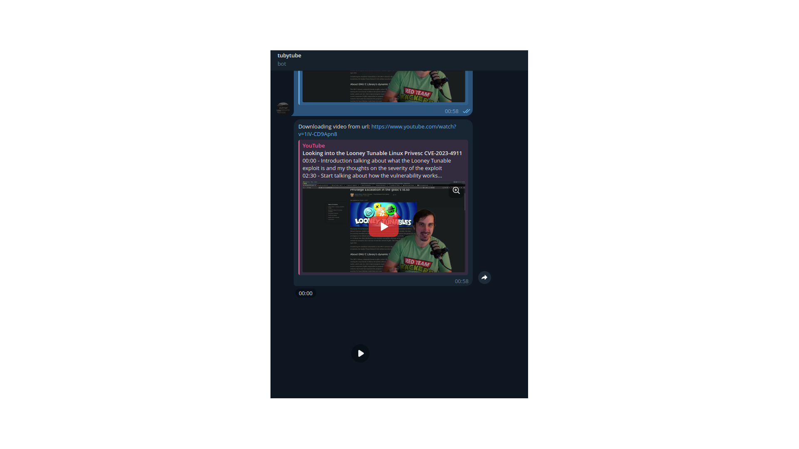

# ytbot

## Motivation



A simple telegram bot written in rust,
that downloads youtube videos to audio/video and sends them back to the user.

## Usage

First prepare an `.env` file where you run your binary.
```
TELOXIDE_TOKEN="<add-ur-token>"
RUSTBOT_DIR="/tmp/"
RUST_LOG="info"
```

Then run:

```
git clone git@github.com:ransomwarezz/ytbot.git
cd ytbot
cargo run
```

## License

This project is licensed under the GPL-3 license.
